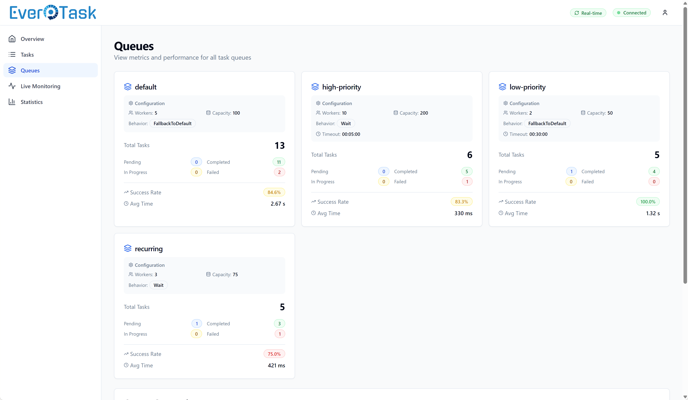

[](https://github.com/GiampaoloGabba/EverTask/actions/workflows/build.yml)
[](https://www.nuget.org/packages/EverTask)
[](https://www.nuget.org/packages/EverTask.Abstractions)
[](https://www.nuget.org/packages/EverTask.Storage.SqlServer)
[](https://www.nuget.org/packages/EverTask.Storage.Sqlite)
[](https://www.nuget.org/packages/EverTask.Storage.EfCore)
[](https://www.nuget.org/packages/EverTask.Logging.Serilog)
[](https://www.nuget.org/packages/EverTask.Monitor.AspnetCore.SignalR)
[](https://www.nuget.org/packages/EverTask.Monitor.Api)

## Overview

**EverTask** is a high-performance .NET library for background task execution. It handles everything from simple fire-and-forget operations to complex recurring schedules, with persistence that survives application restarts.

Supports **CPU-intensive, I/O-bound, long-running and short-running tasks**. No external schedulers or Windows Services required — everything runs in-process with your application.

EverTask doesn't continuously poll the database: it uses a lightweight and optimized in-memory scheduler, coupled with channels and strategic persistence.

If you've used MediatR, you'll feel right at home with the request/handler pattern — but with built-in persistence, multi-queue isolation, and the ability to scale to high load.

Works great with ASP.NET Core, Windows Services, or any .NET project that needs reliable background processing.

## Key Features

### Core Execution
- **Background Execution** — Fire-and-forget, scheduled, and recurring tasks with elegant API
- **Zero Database Polling** — Smart scheduler with in-memory channels and persistence, no continuous database polling
- **Smart Persistence** — Tasks resume after application restarts (SQL Server, SQLite, In-Memory)
- **Fluent Scheduling API** — Intuitive recurring task configuration (every minute, hour, day, week, month, cron)
- **Idempotent Task Registration** — Prevent duplicate recurring tasks with unique keys

### Performance & Scalability
- **Multi-Queue Support** — Isolate workloads by priority, resource type, or business domain
- **High-Performance Scheduler** — Minimal lock contention and zero CPU when idle
- **High Load Support** — Optional sharded scheduler for high-loading scheduling scenarios
- **Optimized Performance** — Reflection caching, lazy serialization, optimized database operations

### Monitoring & Observability
- **Web Dashboard + REST API** — Embedded React UI for monitoring, analytics, and observability
- **Real-Time Updates** — SignalR live monitoring with event-driven cache invalidation
- **Task Execution Log Capture** — Proxy logger with optional database persistence for audit trails
- **Configurable Audit Levels** — Control database bloat with granular audit trail settings

### Resilience & Error Handling
- **Powerful Retry Policies** — Built-in linear retry, custom policies, Polly integration, exception filtering
- **Timeout Management** — Global and per-task timeout configuration

### Developer Experience
- **Extensible Architecture** — Custom storage, retry policies, and schedulers
- **Serilog Integration** — Detailed structured logging
- **Async All The Way** — Fully asynchronous for maximum scalability


## Quick Start

### Installation

```bash
dotnet add package EverTask
dotnet add package EverTask.Storage.SqlServer  # Or EverTask.Storage.Sqlite
```

### Configuration

```csharp
// Register EverTask with SQL Server storage
builder.Services.AddEverTask(opt =>
{
    opt.RegisterTasksFromAssembly(typeof(Program).Assembly);
})
.AddSqlServerStorage(builder.Configuration.GetConnectionString("EverTaskDb"));
```

### Create Your First Task

Define a task request:

```csharp
public record SendWelcomeEmailTask(string UserEmail, string UserName) : IEverTask;
```

Create a handler:

```csharp
public class SendWelcomeEmailHandler : EverTaskHandler<SendWelcomeEmailTask>
{
    private readonly IEmailService _emailService;

    public SendWelcomeEmailHandler(IEmailService emailService)
    {
        _emailService = emailService;
    }

    public override async Task Handle(SendWelcomeEmailTask task, CancellationToken cancellationToken)
    {
        Logger.LogInformation("Sending welcome email to {Email}", task.UserEmail);

        await _emailService.SendWelcomeEmailAsync(
            task.UserEmail,
            task.UserName,
            cancellationToken);
    }
}
```

Dispatch the task:

```csharp
// Send welcome email in background
await _dispatcher.Dispatch(new SendWelcomeEmailTask(dto.Email, dto.Name));
```

## Documentation

📚 **[Full Documentation](https://GiampaoloGabba.github.io/EverTask)** - Complete guides, tutorials, and API reference

### Quick Links

- **[Getting Started](https://GiampaoloGabba.github.io/EverTask/getting-started.html)** - Installation, configuration, and your first task
- **[Task Creation](https://GiampaoloGabba.github.io/EverTask/task-creation.html)** - Requests, handlers, lifecycle hooks, and best practices
- **[Task Dispatching](https://GiampaoloGabba.github.io/EverTask/task-dispatching.html)** - Fire-and-forget, delayed, and scheduled tasks
- **[Recurring Tasks](https://GiampaoloGabba.github.io/EverTask/recurring-tasks.html)** - Fluent scheduling API, cron expressions, idempotent registration
- **[Resilience & Error Handling](https://GiampaoloGabba.github.io/EverTask/resilience.html)** - Retry policies, timeouts, CancellationToken usage
- **[Monitoring](https://GiampaoloGabba.github.io/EverTask/monitoring.html)** - Complete monitoring guide (Dashboard, Events, and Logs)
- **[Scalability](https://GiampaoloGabba.github.io/EverTask/scalability.html)** - Multi-queue support and sharded scheduler for high-load scenarios
- **[Task Orchestration](https://GiampaoloGabba.github.io/EverTask/advanced-features.html)** - Chain tasks, build workflows, and coordinate complex processes
- **[Storage Configuration](https://GiampaoloGabba.github.io/EverTask/storage.html)** - SQL Server, SQLite, In-Memory, custom implementations
- **[Configuration](https://GiampaoloGabba.github.io/EverTask/configuration.html)** - Configure EverTask (Reference + Cheatsheet)
- **[Architecture & Internals](https://GiampaoloGabba.github.io/EverTask/architecture.html)** - How EverTask works under the hood

## Showcase: Powerful Features

### Fluent Recurring Scheduler

Schedule recurring tasks with an intuitive, type-safe API:

```csharp
// Run every day at 3 AM
await dispatcher.Dispatch(
    new DailyCleanupTask(),
    builder => builder.Schedule().EveryDay().AtTime(new TimeOnly(3, 0)));

// Run every Monday, Wednesday, Friday at 9 AM (for 30 days)
var days = new[] { DayOfWeek.Monday, DayOfWeek.Wednesday, DayOfWeek.Friday };
await dispatcher.Dispatch(
    new BackupTask(),
    builder => builder.Schedule().EveryWeek().OnDays(days).AtTime(new TimeOnly(9, 0)).RunUntil(DateTimeOffset.UtcNow.AddDays(30)));
```

### Multi-Queue Workload Isolation

Keep critical tasks separate from heavy background work:

```csharp
// High-priority queue for critical operations
.AddQueue("critical", q => q
    .SetMaxDegreeOfParallelism(20)
    .SetChannelCapacity(500)
    .SetDefaultTimeout(TimeSpan.FromMinutes(2)))
```

### Smart Retry Policies with Exception Filtering

Control which exceptions trigger retries to fail-fast on permanent errors:

```csharp
// Predefined sets for common scenarios
RetryPolicy => new LinearRetryPolicy(5, TimeSpan.FromSeconds(2)).HandleTransientDatabaseErrors();

// Whitelist: Only retry specific exceptions (you can also use DoNotHandle for blacklist)
RetryPolicy = new LinearRetryPolicy(3, TimeSpan.FromSeconds(1)).Handle<DbException>().Handle<HttpRequestException>();

// Predicate: Custom logic (e.g., HTTP 5xx only)
RetryPolicy = new LinearRetryPolicy(3, TimeSpan.FromSeconds(1)).HandleWhen(ex => ex is HttpRequestException httpEx && httpEx.StatusCode >= 500);
```
### Idempotent Task Registration

Use unique keys to safely register recurring tasks at startup without creating duplicates:

```csharp
// Register recurring tasks - safe to call on every startup
    await _dispatcher.Dispatch(
        new DailyCleanupTask(),
        r => r.Schedule().EveryDay().AtTime(new TimeOnly(3, 0)),
        taskKey: "daily-cleanup"); // Won't create duplicates
```

### Monitoring Dashboard

Monitor your tasks with a feature-complete web dashboard providing real-time insights, comprehensive analytics, and detailed observability:

**Dashboard Preview:**

<div align="center">
<table>
<tr>
<td align="center" width="20%">

<br />
<em>Dashboard Overview</em>
</td>
<td align="center" width="20%">

<br />
<em>Task List with Filters</em>
</td>
<td align="center" width="20%">

<br />
<em>Task Details & History</em>
</td>
<td align="center" width="20%">

<br />
<em>Execution Logs Viewer</em>
</td>
<td align="center" width="20%">

<br />
<em>Realtime flow</em>
</td>
</tr>
</table>

📸 **[View all 10 screenshots in the documentation](https://GiampaoloGabba.github.io/EverTask/monitoring-dashboard-ui#screenshots)**

</div>

### Task Execution Log Capture

Capture all logs written during task execution and persist them to the database for debugging and auditing:


<br />
<em>View logs in dashboard or retrieve via storage</em>

[View Complete Changelog](CHANGELOG.md)

## Quick Links

- 📦 **NuGet Packages**
  - [EverTask](https://www.nuget.org/packages/EverTask) - Core library
  - [EverTask.Abstractions](https://www.nuget.org/packages/EverTask.Abstractions) - Lightweight interfaces package
  - [EverTask.Storage.SqlServer](https://www.nuget.org/packages/EverTask.Storage.SqlServer) - SQL Server storage
  - [EverTask.Storage.Sqlite](https://www.nuget.org/packages/EverTask.Storage.Sqlite) - SQLite storage
  - [EverTask.Storage.EfCore](https://www.nuget.org/packages/EverTask.Storage.EfCore) - EF Core base storage
  - [EverTask.Logging.Serilog](https://www.nuget.org/packages/EverTask.Logging.Serilog) - Serilog integration
  - [EverTask.Monitor.AspnetCore.SignalR](https://www.nuget.org/packages/EverTask.Monitor.AspnetCore.SignalR) - Real-time monitoring
  - [EverTask.Monitor.Api](https://www.nuget.org/packages/EverTask.Monitor.Api) - Monitoring API and Dashboard

- 📝 **Resources**
  - [Changelog](CHANGELOG.md) - Version history and release notes
  - [Attribution](ATTRIBUTION.md) - Acknowledgements and license information
  - [GitHub Repository](https://github.com/GiampaoloGabba/EverTask) - Source code and issues
  - [Examples](samples/) - Sample applications (ASP.NET Core, Console)

## Roadmap

We have some exciting features in the pipeline:

- **Task Management API**: REST endpoints for stopping, restarting, and canceling tasks via the dashboard
- **Distributed Clustering**: Multi-server task distribution with leader election and automatic failover
- **Advanced Throttling**: Rate limiting and adaptive throttling based on system resources
- **Workflow Orchestration**: Complex workflow and saga orchestration with fluent API
- **Additional Monitoring**: Sentry Crons, Application Insights, OpenTelemetry support
- **More Storage Options**: PostgreSQL, MySQL, Redis, Cosmos DB

## Contributing

Contributions are welcome! Bug reports, feature requests, and pull requests all help make EverTask better.

- Report issues: https://github.com/GiampaoloGabba/EverTask/issues
- Contribute code: https://github.com/GiampaoloGabba/EverTask/pulls

## License

EverTask is licensed under the [Apache License 2.0](LICENSE).

See [ATTRIBUTION.md](ATTRIBUTION.md) for acknowledgements and attributions.

---

**Developed with ❤️ by [Giampaolo Gabba](https://github.com/GiampaoloGabba)**
