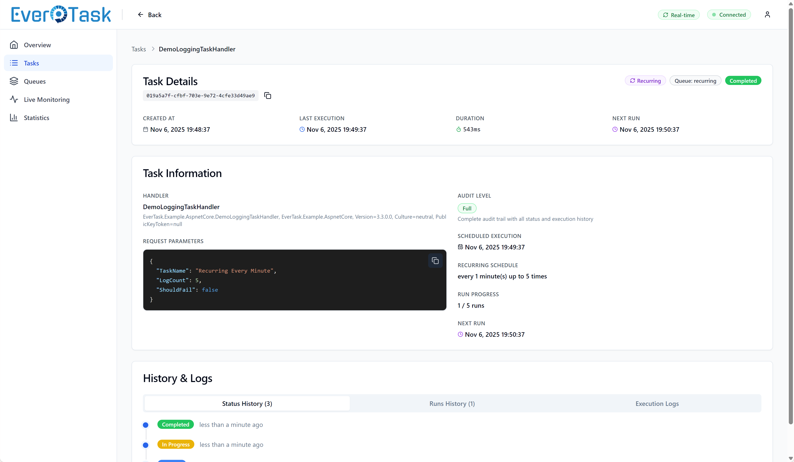
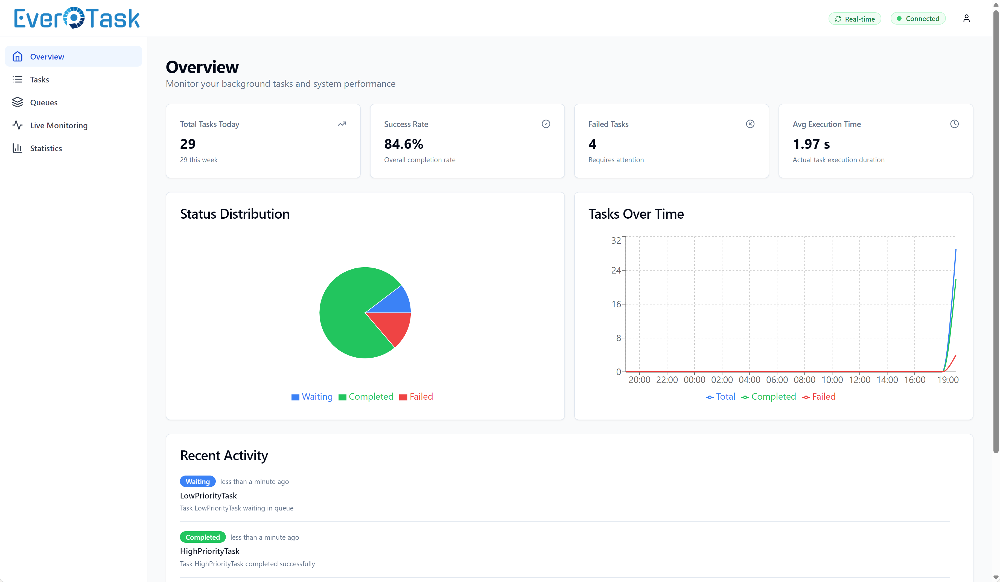
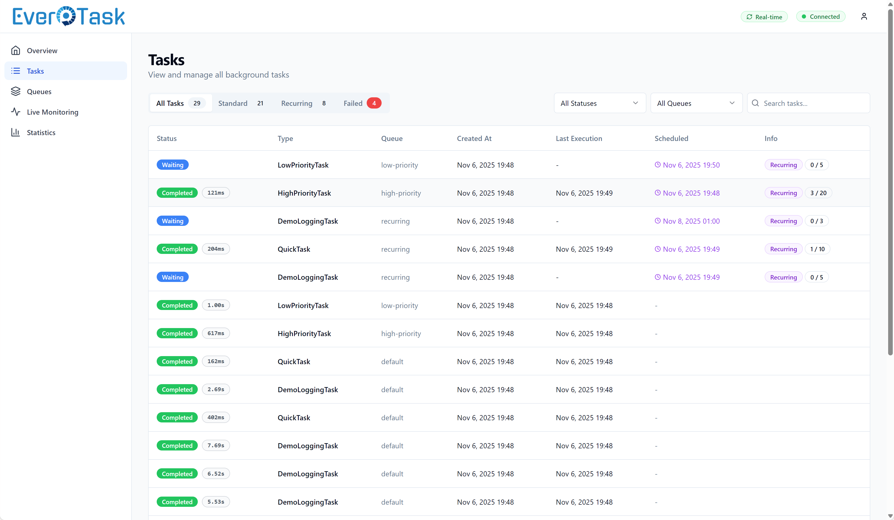
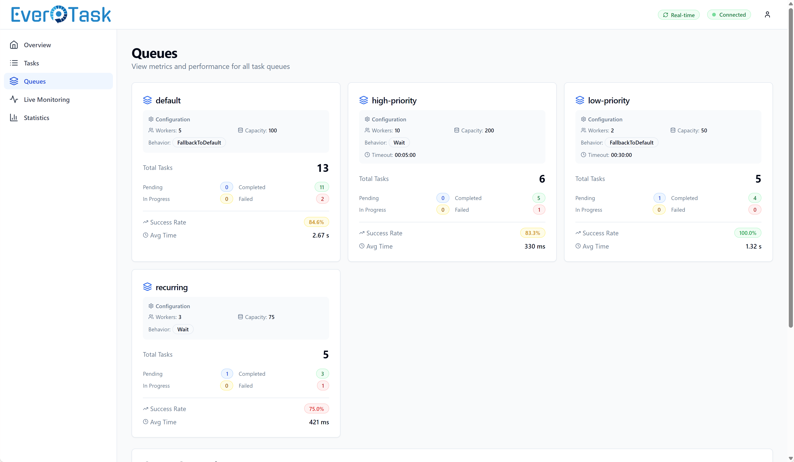
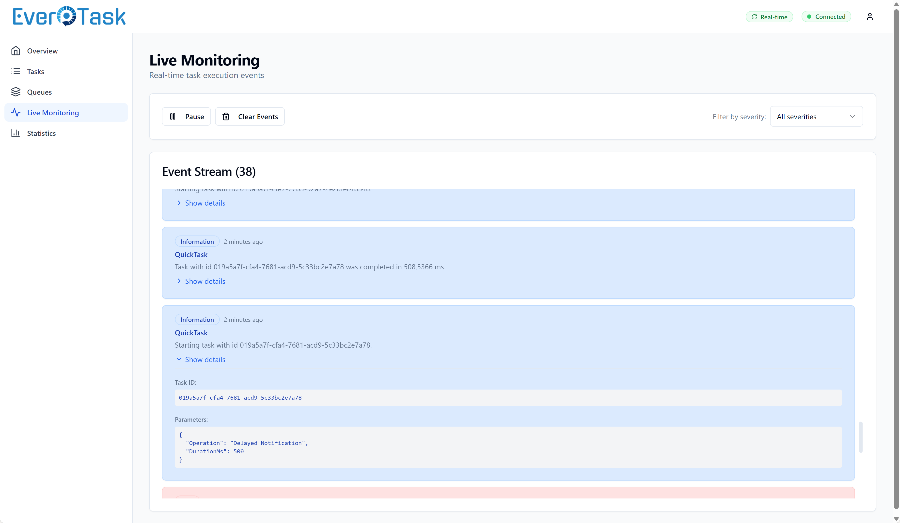
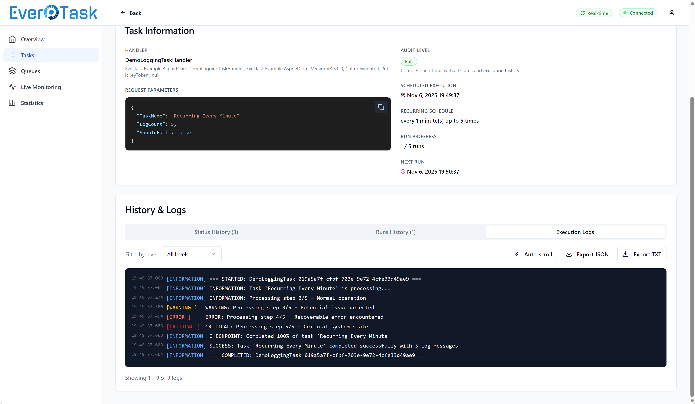

[](https://github.com/GiampaoloGabba/EverTask/actions/workflows/build.yml)
[](https://www.nuget.org/packages/EverTask)
[](https://www.nuget.org/packages/EverTask.Abstractions)
[](https://www.nuget.org/packages/EverTask.Storage.SqlServer)
[](https://www.nuget.org/packages/EverTask.Storage.Sqlite)
[](https://www.nuget.org/packages/EverTask.Storage.Postgres)
[](https://www.nuget.org/packages/EverTask.Storage.MySql)
[](https://www.nuget.org/packages/EverTask.Storage.EfCore)
[](https://www.nuget.org/packages/EverTask.Logging.Serilog)
[](https://www.nuget.org/packages/EverTask.Monitor.AspnetCore.SignalR)
[](https://www.nuget.org/packages/EverTask.Monitor.Api)

## Overview

**EverTask** runs background work in your .NET app: fire-and-forget jobs, delayed and scheduled tasks, and recurring schedules. Everything is persisted, so tasks survive a restart.

It runs in-process (no external scheduler, no Windows Service, no separate worker host), and it doesn't poll the database in a loop. An in-memory scheduler drives execution through channels, and persistence happens where it matters: on enqueue, on status changes, and for recovery after a restart.

If you've used MediatR, the request/handler pattern will feel familiar. The difference is that here tasks are persisted, can be isolated across queues, and keep working under load.

Tasks can be CPU-bound or I/O-bound, long- or short-running. Works with ASP.NET Core, Windows Services, or any .NET host.

## Key Features

### Core execution
- **Background execution**: fire-and-forget, scheduled, and recurring tasks
- **No database polling**: the scheduler lives in memory and runs through channels; the database is written, not polled in a loop
- **Persistence**: tasks resume after a restart (SQL Server, PostgreSQL, MySQL/MariaDB, SQLite, In-Memory)
- **Fluent scheduling**: recurring tasks by minute, hour, day, week, month, or cron
- **Idempotent registration**: a task key keeps duplicate recurring registrations out

### Performance & scalability
- **Multi-queue**: isolate workloads by priority, resource type, or business domain
- **Keyed rate limiting**: throttle per tenant/account/resource against external API limits, without blocking workers or other keys
- **Light scheduler**: minimal lock contention, zero CPU when idle
- **Sharded scheduler**: optional, for high scheduling load
- **Lower overhead**: reflection caching and lazy serialization

### Monitoring
- **Dashboard + REST API**: an embedded React UI for monitoring and analytics
- **Real-time updates**: SignalR push with event-driven cache invalidation
- **Execution log capture**: a proxy logger with optional database persistence and configurable retention
- **Audit levels**: tune how much audit history you keep, to control table growth

### Resilience
- **Retry policies**: built-in linear retry, custom policies, Polly integration, exception filtering
- **Timeouts**: global and per-task

### Developer experience
- **Extensible**: custom storage, retry policies, and schedulers
- **Serilog integration**: structured logging
- **Async throughout**
- **Compile-time payload analyzer**: a Roslyn analyzer (ET0001–ET0007) bundled in `EverTask.Abstractions`
  catches System.Text.Json contract violations in the IDE/build, with code fixes (see below)




## Quick Start

### Installation

```bash
dotnet add package EverTask
dotnet add package EverTask.Storage.SqlServer  # Or EverTask.Storage.Postgres / EverTask.Storage.MySql / EverTask.Storage.Sqlite
```

### Configuration

```csharp
// Register EverTask with SQL Server storage
builder.Services.AddEverTask(opt =>
{
    opt.RegisterTasksFromAssembly(typeof(Program).Assembly);
})
.AddSqlServerStorage(builder.Configuration.GetConnectionString("EverTaskDb"));
```

### Create Your First Task

Define a task request:

```csharp
public record SendWelcomeEmailTask(string UserEmail, string UserName) : IEverTask;
```

Create a handler:

```csharp
public class SendWelcomeEmailHandler : EverTaskHandler<SendWelcomeEmailTask>
{
    private readonly IEmailService _emailService;

    public SendWelcomeEmailHandler(IEmailService emailService)
    {
        _emailService = emailService;
    }

    public override async Task Handle(SendWelcomeEmailTask task, CancellationToken cancellationToken)
    {
        Logger.LogInformation("Sending welcome email to {Email}", task.UserEmail);

        await _emailService.SendWelcomeEmailAsync(
            task.UserEmail,
            task.UserName,
            cancellationToken);
    }
}
```

Dispatch the task:

```csharp
// Send welcome email in background
await _dispatcher.Dispatch(new SendWelcomeEmailTask(dto.Email, dto.Name));
```

## AI-assisted setup (agent skill)

This repo ships an agent skill that wires up EverTask for you. On [Claude Code](https://claude.com/claude-code):

```text
/plugin marketplace add GiampaoloGabba/EverTask
/plugin install evertask@evertask
```

Then `/reload-plugins` and run `/evertask:integrate-evertask`. For other agents, copy `plugins/evertask/skills/integrate-evertask/` into your skills directory. Full guide: [agent skill](https://GiampaoloGabba.github.io/EverTask/agent-skill.html).

## Documentation

📚 **[Full Documentation](https://GiampaoloGabba.github.io/EverTask)** - Complete guides, tutorials, and API reference

### Quick Links

- **[Getting Started](https://GiampaoloGabba.github.io/EverTask/getting-started.html)** - Installation, configuration, and your first task
- **[Task Creation](https://GiampaoloGabba.github.io/EverTask/task-creation.html)** - Requests, handlers, lifecycle hooks, and best practices
- **[Task Dispatching](https://GiampaoloGabba.github.io/EverTask/task-dispatching.html)** - Fire-and-forget, delayed, and scheduled tasks
- **[Recurring Tasks](https://GiampaoloGabba.github.io/EverTask/recurring-tasks.html)** - Fluent scheduling API, cron expressions, idempotent registration
- **[Resilience & Error Handling](https://GiampaoloGabba.github.io/EverTask/resilience.html)** - Retry policies, timeouts, CancellationToken usage
- **[Monitoring](https://GiampaoloGabba.github.io/EverTask/monitoring.html)** - Complete monitoring guide (Dashboard, Events, and Logs)
- **[Scalability](https://GiampaoloGabba.github.io/EverTask/scalability.html)** - Multi-queue support, keyed rate limiting, and sharded scheduler for high-load scenarios
- **[Task Orchestration](https://GiampaoloGabba.github.io/EverTask/advanced-features.html)** - Chain tasks, build workflows, and coordinate complex processes
- **[Storage Configuration](https://GiampaoloGabba.github.io/EverTask/storage.html)** - SQL Server, PostgreSQL, MySQL/MariaDB, SQLite, In-Memory, custom implementations
- **[Configuration](https://GiampaoloGabba.github.io/EverTask/configuration.html)** - Configure EverTask (Reference + Cheatsheet)
- **[Agent Skill](https://GiampaoloGabba.github.io/EverTask/agent-skill.html)** - AI-assisted integration: install the skill and let an agent wire up EverTask (one-step on Claude Code)
- **[Architecture & Internals](https://GiampaoloGabba.github.io/EverTask/architecture.html)** - How EverTask works under the hood

## A closer look

### Fluent Recurring Scheduler

Schedule recurring tasks with a type-safe API:

```csharp
// Run every day at 3 AM
await dispatcher.Dispatch(
    new DailyCleanupTask(),
    builder => builder.Schedule().EveryDay().AtTime(new TimeOnly(3, 0)));

// Run every Monday, Wednesday, Friday at 9 AM (for 30 days)
var days = new[] { DayOfWeek.Monday, DayOfWeek.Wednesday, DayOfWeek.Friday };
await dispatcher.Dispatch(
    new BackupTask(),
    builder => builder.Schedule().EveryWeek().OnDays(days).AtTime(new TimeOnly(9, 0)).RunUntil(DateTimeOffset.UtcNow.AddDays(30)));
```

### Multi-Queue Workload Isolation

Keep critical tasks separate from heavy background work:

```csharp
// High-priority queue for critical operations
.AddQueue("critical", q => q
    .SetMaxDegreeOfParallelism(20)
    .SetChannelCapacity(500)
    .SetDefaultTimeout(TimeSpan.FromMinutes(2)))
```

### Retry policies with exception filtering

Control which exceptions trigger retries to fail-fast on permanent errors:

```csharp
// Predefined sets for common scenarios
RetryPolicy => new LinearRetryPolicy(5, TimeSpan.FromSeconds(2)).HandleTransientDatabaseErrors();

// Whitelist: Only retry specific exceptions (you can also use DoNotHandle for blacklist)
RetryPolicy => new LinearRetryPolicy(3, TimeSpan.FromSeconds(1)).Handle<DbException>().Handle<HttpRequestException>();

// Predicate: Custom logic (e.g., HTTP 5xx only)
RetryPolicy => new LinearRetryPolicy(3, TimeSpan.FromSeconds(1)).HandleWhen(ex => ex is HttpRequestException httpEx && httpEx.StatusCode >= 500);
```

### Keyed Rate Limiting

Throttle tasks against external API limits (per tenant, per account, per resource) without slowing anyone else down:

```csharp
public record SyncTenantData(Guid TenantId) : IEverTask, IRateLimitedTask
{
    public string RateLimitKey => TenantId.ToString();
}

public class SyncTenantDataHandler : EverTaskHandler<SyncTenantData>
{
    // Each tenant gets 15 calls per minute; other tenants are unaffected
    public override RateLimitPolicy? RateLimitPolicy =>
        new RateLimitPolicy(15, TimeSpan.FromMinutes(1));

    public override Task Handle(SyncTenantData task, CancellationToken ct) => ...;
}
```

When a task exceeds its key's budget, EverTask reserves the next available slot and re-schedules it automatically: no worker is blocked, no task is dropped, and tasks for other keys keep flowing. Rate limiting is in-memory and per-instance (a pluggable seam for distributed limiters is on the [roadmap](#roadmap)).

### Idempotent Task Registration

Use unique keys to safely register recurring tasks at startup without creating duplicates:

```csharp
// Register recurring tasks - safe to call on every startup
    await _dispatcher.Dispatch(
        new DailyCleanupTask(),
        r => r.Schedule().EveryDay().AtTime(new TimeOnly(3, 0)),
        taskKey: "daily-cleanup"); // Won't create duplicates
```

> ⚠️ **Self-redispatch gotcha**: while a handler is executing, its task is `InProgress`. A dispatch with the
> same key as an `InProgress` task is a no-op that returns the existing ID without scheduling anything (a
> warning is logged). If a handler re-dispatches itself (e.g. polling chains), use a null or per-attempt key
> like `"my-task-{id}-{attempt}"`; reserve stable keys for dispatches originating outside the handler.

### Monitoring Dashboard

Monitor tasks from a built-in web dashboard with live status, task history, execution logs, and analytics:

**Dashboard Preview:**

<div align="center">
<table>
<tr>
<td align="center" width="20%">

<br />
<em>Dashboard Overview</em>
</td>
<td align="center" width="20%">

<br />
<em>Task List with Filters</em>
</td>
<td align="center" width="20%">

<br />
<em>Task Details & History</em>
</td>
<td align="center" width="20%">

<br />
<em>Execution Logs Viewer</em>
</td>
<td align="center" width="20%">

<br />
<em>Realtime flow</em>
</td>
</tr>
</table>

📸 **[View all 10 screenshots in the documentation](https://GiampaoloGabba.github.io/EverTask/monitoring-dashboard-ui#screenshots)**

</div>

### Task Execution Log Capture

Capture all logs written during task execution and persist them to the database for debugging and auditing. Built-in retention (a time window plus a per-task cap) keeps log growth bounded for long-running and recurring tasks:


<br />
<em>View logs in dashboard or retrieve via storage</em>

### Compile-time payload contract analyzer

Tasks are persisted with System.Text.Json, and its contract is stricter than Newtonsoft's. A violation used to
surface only at runtime, on recovery: a silently dropped member, or a deserialization throw. The Roslyn analyzer
bundled in `EverTask.Abstractions` (no extra package, no runtime dependency) catches it the moment you reference
`IEverTask`, in the IDE and in the build:

| Rule | Default | What it catches |
|------|---------|-----------------|
| **ET0001** | Warning | Public field on a payload (STJ serializes properties only). *Code fix: convert to property* |
| **ET0002** | Warning | Property with a non-public setter and no matching constructor parameter (dropped on read). *Code fix* |
| **ET0003** | Warning | Newtonsoft.Json attribute (ignored by STJ). *Code fix: remove / map to the STJ equivalent* |
| **ET0004** | Warning | Abstract/interface property without `[JsonPolymorphic]`+`[JsonDerivedType]` (throws on recovery). *Code fix: scaffold* |
| **ET0005** | Info | `object` / `Dictionary<string,object>` (comes back as `JsonElement`) |
| **ET0006** | Off (opt-in) | Types unlikely to round-trip (delegate, `Stream`, `Type`, `IntPtr`, `DbContext`, `ValueTuple`, …) |
| **ET0007** | Warning | Multiple public constructors, none parameterless or `[JsonConstructor]` (STJ throws on recovery) |

Every rule is configurable via `.editorconfig` (e.g. `dotnet_diagnostic.ET0001.severity = error`).

> Note: the payload serializer is reflection-based and isolated: a consumer's own STJ source generators don't
> affect it, and Native AOT / reflection-disabled builds are unsupported (see `EverTask.Abstractions` docs).

[View Complete Changelog](CHANGELOG.md)

## Quick Links

- 📦 **NuGet Packages**
  - [EverTask](https://www.nuget.org/packages/EverTask) - Core library
  - [EverTask.Abstractions](https://www.nuget.org/packages/EverTask.Abstractions) - Lightweight interfaces package
  - [EverTask.Storage.SqlServer](https://www.nuget.org/packages/EverTask.Storage.SqlServer) - SQL Server storage
  - [EverTask.Storage.Sqlite](https://www.nuget.org/packages/EverTask.Storage.Sqlite) - SQLite storage
  - [EverTask.Storage.Postgres](https://www.nuget.org/packages/EverTask.Storage.Postgres) - PostgreSQL storage
  - [EverTask.Storage.MySql](https://www.nuget.org/packages/EverTask.Storage.MySql) - MySQL/MariaDB storage
  - [EverTask.Storage.EfCore](https://www.nuget.org/packages/EverTask.Storage.EfCore) - EF Core base storage
  - [EverTask.Logging.Serilog](https://www.nuget.org/packages/EverTask.Logging.Serilog) - Serilog integration
  - [EverTask.Monitor.AspnetCore.SignalR](https://www.nuget.org/packages/EverTask.Monitor.AspnetCore.SignalR) - Real-time monitoring
  - [EverTask.Monitor.Api](https://www.nuget.org/packages/EverTask.Monitor.Api) - Monitoring API and Dashboard

- 📝 **Resources**
  - [Changelog](CHANGELOG.md) - Version history and release notes
  - [Attribution](ATTRIBUTION.md) - Acknowledgements and license information
  - [GitHub Repository](https://github.com/GiampaoloGabba/EverTask) - Source code and issues
  - [Examples](samples/) - Sample applications (ASP.NET Core, Console)

## Roadmap

On the roadmap:

- **Task Management API**: REST endpoints for stopping, restarting, and canceling tasks via the dashboard
- **Distributed Clustering**: Multi-server task distribution with leader election and automatic failover
- **Distributed Rate Limiting**: Redis-based keyed limiter sharing budgets across instances (the in-process keyed rate limiting shipped in 3.7.0; the `IKeyedRateLimiter` DI seam is ready)
- **Adaptive Throttling**: Dynamic throttling based on system resources
- **Workflow Orchestration**: Complex workflow and saga orchestration with fluent API
- **Additional Monitoring**: Sentry Crons, Application Insights, OpenTelemetry support
- **More Storage Options**: Redis, Cosmos DB (PostgreSQL and MySQL/MariaDB shipped)

## Contributing

Contributions are welcome. Bug reports, feature requests, and pull requests all help.

- Report issues: https://github.com/GiampaoloGabba/EverTask/issues
- Contribute code: https://github.com/GiampaoloGabba/EverTask/pulls

## License

EverTask is licensed under the [Apache License 2.0](LICENSE).

See [ATTRIBUTION.md](ATTRIBUTION.md) for acknowledgements and attributions.

---

**Developed with ❤️ by [Giampaolo Gabba](https://github.com/GiampaoloGabba)**
