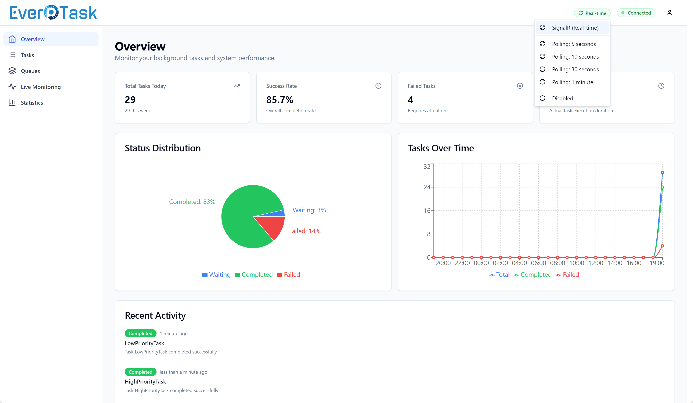
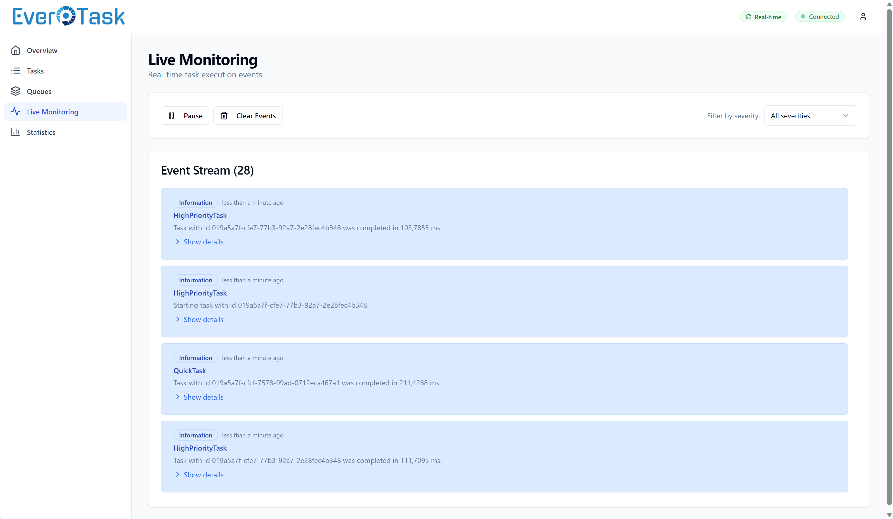
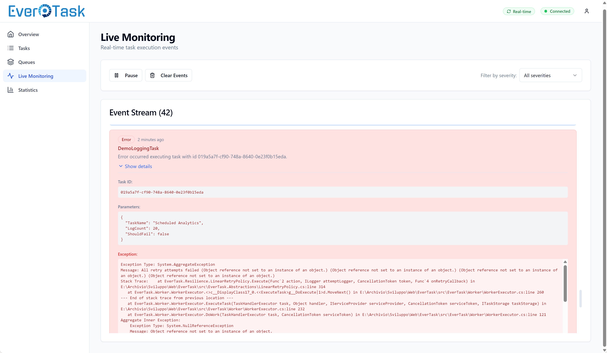

# Dashboard UI Guide

Visual interface guide for the EverTask Monitoring Dashboard with comprehensive screenshots and feature walkthrough.

> **Note**: The dashboard is currently **read-only** (v3.2). You can view, analyze, filter, and export all task data, but cannot perform management operations like stopping, restarting, or cancelling tasks through the UI. Task management features will be added in future releases.

## Table of Contents

- [Overview](#overview)
- [Dashboard Features](#dashboard-features)
  - [Overview Page](#overview-page)
  - [Task List View](#task-list-view)
  - [Task Detail View](#task-detail-view)
  - [Queue Metrics](#queue-metrics)
  - [Statistics & Analytics](#statistics--analytics)
- [Real-Time Updates](#real-time-updates)
- [Screenshot Gallery](#screenshot-gallery)

## Overview

The embedded React dashboard provides a modern, responsive interface for comprehensive read-only monitoring of your tasks.

**Key Capabilities:**
- ✅ Real-time task monitoring with SignalR integration
- ✅ Advanced filtering and search
- ✅ Detailed execution logs and audit trails
- ✅ Performance analytics and trends
- ✅ Multi-queue monitoring
- ✅ Terminal-style log viewer with color-coded severity levels

**Access the Dashboard:**
```
URL: http://localhost:5000/evertask-monitoring
Default Credentials: admin / admin
```

## Dashboard Features

### Overview Page

The main dashboard shows:

**Key Metrics:**
- **Total Tasks** - Complete count with breakdown by status (Queued, In Progress, Completed, Failed, Cancelled)
- **Success Rate** - Percentage with visual indicator and color coding (green >90%, yellow 70-90%, red <70%)
- **Active Queues** - Number of queues currently processing tasks
- **Average Execution Time** - Mean duration in milliseconds across all completed tasks
- **Recurring Tasks** - Count of scheduled recurring tasks

**Visual Analytics:**
- **Tasks Over Time** - Line chart showing completed vs failed tasks with hourly/daily aggregation
- **Queue Summaries** - Card-based view with status breakdown per queue
- **Recent Activity** - Live feed of latest task updates (last 50 events)

**Time Range Filters:**
Select different time ranges for metrics:
- Today (default)
- Week (last 7 days)
- Month (last 30 days)
- All time

### Task List View

Browse and filter tasks with powerful search capabilities:

**Status Filters:**
Quick-access filters for common statuses:
- 🟡 **Queued** - Tasks waiting to execute
- 🔵 **In Progress** - Currently executing tasks
- 🟢 **Completed** - Successfully finished tasks
- 🔴 **Failed** - Tasks that encountered errors
- ⚫ **Cancelled** - Manually cancelled tasks

**Advanced Filtering:**
- **Queue Filter** - Filter by specific queue name
- **Task Type Filter** - Search by task type (supports partial matching)
- **Recurring Filter** - Toggle to show only recurring tasks
- **Date Range Filter** - Filter by creation date with date picker

**Sorting:**
- Sort by any column (Created Date, Last Execution, Status, Type)
- Toggle ascending/descending order
- Default: Most recent first

**Pagination:**
- Configurable page size (10, 20, 50, 100 items)
- Navigate through large datasets efficiently
- Total count and page info displayed

**Table Columns:**
- Task ID (clickable for details)
- Task Type (fully qualified name)
- Handler Type
- Status (color-coded badge)
- Queue Name
- Created Date (relative time + tooltip with absolute time)
- Last Execution Date
- Next Run (for recurring tasks)

### Task Detail View

Click any task to view comprehensive details in a modal overlay:

**Task Information:**
- **Task ID** - Unique identifier (GUID)
- **Task Type** - Fully qualified type name
- **Handler Type** - Handler class name
- **Status** - Current status with color indicator
- **Queue Name** - Assigned queue
- **Parameters** - JSON-formatted task parameters with syntax highlighting

**Timing Information:**
- **Created At** - When the task was created
- **Scheduled At** - When the task was scheduled to run (if applicable)
- **Last Execution** - Most recent execution timestamp
- **Completed At** - When the task finished (if completed)

**Recurring Information** (for recurring tasks):
- **Schedule** - Cron expression or interval
- **Max Runs** - Maximum execution limit (if set)
- **Current Run Count** - Number of times executed
- **Next Run** - Next scheduled execution time
- **Run Until** - Expiration date (if set)

**Tabs:**

1. **Status History** - Complete audit trail:
   - All status transitions (Queued → InProgress → Completed)
   - Timestamps for each change
   - Error details for failed transitions
   - Visual timeline view

2. **Execution History** - All execution attempts:
   - Execution start/completion times
   - Duration calculation
   - Status outcome (Completed/Failed)
   - Error details for failed runs
   - Especially useful for recurring tasks to track reliability

3. **Execution Logs** - Terminal-style log viewer:
   - Color-coded severity levels (Info, Warning, Error)
   - Structured log data with timestamps
   - Search and filter capabilities
   - Export to JSON/CSV
   - Syntax highlighting for stack traces

**Error Details:**
- Full exception message
- Stack trace with syntax highlighting
- Inner exception details (if present)
- Copy to clipboard functionality

**Actions:**
- Copy Task ID
- Copy Parameters (JSON)
- Export task details (JSON)
- Refresh task data

### Queue Metrics

Monitor queue health and performance:

**Queue Cards:**
Each queue displays:
- **Queue Name** - Identifier
- **Task Distribution** - Breakdown by status:
  - Queued (waiting)
  - In Progress (executing)
  - Completed (successful)
  - Failed (errors)
  - Cancelled (terminated)
- **Success Rate** - Percentage with color indicator
- **Active Tasks** - Currently executing count
- **Total Tasks** - Historical count

**Visual Indicators:**
- 🟢 Green - Success rate >90%
- 🟡 Yellow - Success rate 70-90%
- 🔴 Red - Success rate <70%
- Progress bars for task distribution
- Real-time updates via SignalR

**Actions:**
- Click queue card to filter task list by queue
- View queue-specific analytics
- Monitor queue capacity and throughput

### Statistics & Analytics

Analyze performance trends and identify bottlenecks:

**Success Rate Trends:**
- Line chart showing historical success rate
- Time periods:
  - Last 7 Days (default)
  - Last 30 Days
  - Last 90 Days
- Data points include:
  - Success rate percentage
  - Total tasks executed
  - Successful vs failed count
- Hover tooltips with detailed breakdown

**Task Type Distribution:**
- Pie chart or bar chart showing task frequency
- See which tasks run most frequently
- Identify hotspot task types
- Filter by time range (Today, Week, Month, All)
- Click segments to filter task list

**Execution Time Analysis:**
- Table showing execution time statistics by task type
- Columns:
  - Task Type
  - Average Execution Time (ms)
  - Min Execution Time (ms)
  - Max Execution Time (ms)
  - Task Count (sample size)
- Sort by any metric
- Identify slow tasks and performance bottlenecks
- Color-coded performance indicators:
  - 🟢 Fast (<1s average)
  - 🟡 Moderate (1-5s average)
  - 🔴 Slow (>5s average)

**Time Range Filters:**
All statistics support time range filtering:
- Today - Current day only
- Week - Last 7 days
- Month - Last 30 days
- All - Complete history

## Real-Time Updates

The dashboard uses SignalR for real-time event-driven cache invalidation with intelligent debouncing.

**How It Works:**
1. SignalR events trigger cache invalidation instead of periodic polling
2. Multiple rapid events are debounced to prevent excessive API calls during task bursts
3. Dashboard automatically updates when:
   - Tasks are dispatched
   - Tasks start executing
   - Tasks complete or fail
   - Status changes occur

**Configuration:**
Control responsiveness via `EventDebounceMs` option:

```csharp
.AddMonitoringApi(options =>
{
    options.EventDebounceMs = 1000;  // Wait 1 second before refreshing (default)
    // Recommended values:
    // - 300ms: Very responsive (low-volume environments)
    // - 500ms: Balanced (moderate responsiveness, good efficiency)
    // - 1000ms: Conservative (best for high-volume task processing)
});
```

**Benefits:**
- ✅ **Reduced Network Traffic** - Batches multiple rapid events into single API calls
- ✅ **Better Performance** - Prevents UI thrashing during task bursts
- ✅ **Seamless Fallback** - Automatically switches to polling when SignalR disconnects

**Visual Indicators:**
- 🟢 Connected - SignalR active, real-time updates enabled
- 🟡 Connecting - Attempting to establish connection
- 🔴 Disconnected - Fallback to polling mode (30s interval)
- Refresh icon spins during data fetch
- Last updated timestamp shown

**Manual Refresh:**
- Refresh button available in the header
- Force-refresh any view on demand
- Bypasses debounce for immediate update

## Screenshot Gallery

Explore the dashboard interface with these annotated screenshots:

<div align="center">

### Overview Dashboard

*Real-time overview with task statistics, success rates, and activity charts*

---

### Task List View

*Comprehensive task list with filtering, sorting, and pagination*

---

### Task Detail Modal

*Detailed task information with parameters, status, and execution history*

---

### Execution Logs Viewer

*Terminal-style execution logs with color-coded severity levels*

---

### Status History

*Complete audit trail of task status transitions*

---

### Queue Metrics

*Multi-queue monitoring with task distribution and success rates*

---

### Statistics & Analytics

*Performance analytics and success rate trends over time*

---

### Task Filtering

*Advanced filtering by status, queue, type, and date range*

---

### Real-Time Updates

*Live task updates with SignalR integration and refresh controls*

---

### Execution Runs History

*Detailed execution history for recurring tasks with timing information*

</div>

## Navigation Tips

**Keyboard Shortcuts:**
- `Esc` - Close modal overlays
- `Ctrl+F` / `Cmd+F` - Focus search box (browser default)
- `Enter` - Apply filters
- `Ctrl+R` / `Cmd+R` - Refresh current view

**Mouse Actions:**
- Click task row → Open detail modal
- Click queue card → Filter by queue
- Click chart segment → Filter by that data point
- Hover metrics → Show detailed tooltips
- Double-click task ID → Copy to clipboard

**Responsive Design:**
- Desktop (>1200px) - Full multi-column layout
- Tablet (768-1200px) - Stacked layout with collapsible sidebar
- Mobile (<768px) - Single column with hamburger menu

**Browser Support:**
- Chrome 90+ ✅
- Firefox 88+ ✅
- Edge 90+ ✅
- Safari 14+ ✅

## Accessibility

The dashboard follows WCAG 2.1 Level AA guidelines:

- **Keyboard Navigation** - Full keyboard support for all interactive elements
- **Screen Reader** - ARIA labels and semantic HTML
- **Color Contrast** - Meets AA standards (4.5:1 for normal text)
- **Focus Indicators** - Clear visual focus states
- **Alternative Text** - Images and icons have descriptive alt text

## Next Steps

- **[Monitoring Dashboard](monitoring-dashboard.md)** - Setup, configuration, and security
- **[API Reference](monitoring-api-reference.md)** - Complete REST API documentation
- **[Custom Event Monitoring](monitoring-events.md)** - Event-based monitoring and integrations
- **[Configuration Reference](configuration-reference.md)** - All configuration options
